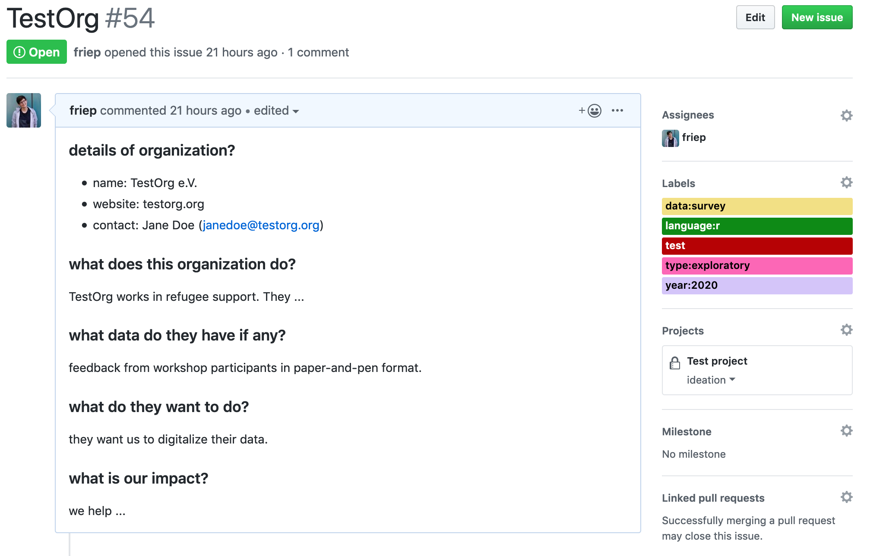
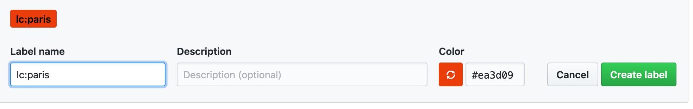

# GitHub "projects" Repository

For now, we keep track of our projects in a central [GitHub repository](https://github.com/CorrelAid/projects). There, we manage the projects, update on their progress and keep process information. This repository is private because of the potentially sensitive information stored there. If you need access because you are coordinating a project, then contact Frie \(@frie\) on Slack.

### What is the CorrelAid/projects repository?



### Projects as GitHub issues  

Each project is stored as a GitHub issue. GitHub issues are usually used in software development projects to keep track of to-dos, bugs etc.

GitHub issues have certain features. Let's look at an [example issue](https://github.com/pandas-dev/pandas/issues/20110) and let's see how we'll make use of them when keeping track of CorrelAid projects compared to typical software development use cases.Alt text below

_Description of screenshot: Screnshot of a_ [_GitHub issue_](https://github.com/pandas-dev/pandas/issues/20110) _from the repository of the popular python package pandas. It is called "_CLN: remove fastpath & verify\_integrity from constructors_". It has an extensive description and two more comments are shown. No-one is assigned to the issue but it is labelled with the two labels "clean" and "indexing". It is also assigned to a project called "Datetime Array Refactor" and to a milestone "Contributions Welcome". The different elements of the GitHub issue - description, title, discussion, assignee, labels, projects and milestones, were framed with black boxes and labelled with the letters A to G._

| Letter | Name |  software development | CorrelAid project |
| :--- | :--- | :--- | :--- |
| A | issue title | a short title that summarizes the feature / bug / to-do. | typically the name of the organization |
| B | issue description | a more detailed description of the feature / bug | details on the organization, what kind of data they have \(if any\), etc. There's a template for this \(explained below\). The description can be updated throughout the course of the project \(e.g. we might later find out what data they have etc\). |
| C | comments, updates | discussions related to the issue, e.g. clarifications \(what system has the issue submitter?\), technical discussions, code review discussions, etc. | updates over the course of the project, e.g. if there are delays at the organization's side or other information that is not important for the description. |
| D | assignee\(s\) | who is responsible for fixing the bug / implementing the feature | who is the project coordinator for the project? This can change over the course of a project, e.g. when the original project coordinator does not have time anymore. |
| E | label\(s\) | used to group issues thematically. | we use labels to keep meta information about the projects. More below. |
| F | project boards | project boards are GitHub's implementation of [Kanban boards](https://en.wikipedia.org/wiki/Kanban_board) --&gt; usually there are at least three "columns" of a project board: "to-do", "in progress" and "done". Issues are then moved to the next stage once completed. E.g. when an work on an issue is started, it's moved from "to-do" to "in progress". | We represent our project progress using a project board. There are several phases a project goes through, from initial aquisition over ideation to project work. All stages are outlined below. |
| G | milestone | "You can use milestones to track progress on groups of issues or pull requests in a repository." | NA |

### Creating a GitHub issue

To create a project, you need to create a GitHub issue. To do that, go to [https://github.com/CorrrelAid/issues](https://github.com/CorrrelAid/issues) and click on "New issue". You'll be prompted to use the issue template which will give you a template with some questions about the organisation to structure your description. But feel free to ignore it!

Here you can see an example project / GitHub issue:

_Description of screenshot: Screnshot of a test GitHub issue from the CorrelAid/projects repository. It is called "TestOrg", and its description contains made-up information on the fictional "TestOrg e.V.". The issue uses the_ [_issue template_](https://github.com/CorrelAid/projects/blob/master/.github/ISSUE_TEMPLATE/project-template.md)_, so information is structured around those questionns. Right next to the description are the metadata: assignee, labels and the assigned project._

It is not necessary to have complete information at the beginning. Just fill in what you know _now_, and if it's only the name of the organisation. You can always come back and edit the description later by clicking on the three dots in the top right of the description or adding more labels later on.

What you should try to at least do: 

* assign yourself and/or someone else to the issue/project \(in doubt: Frie / friep\) so that there's a person that feels responsible. 
* add the year label: this is just an easy catch and gives you a nice colorful label. 🎉 
* add minimal description if possible: try to at least add the name of the organization and the contact person. If you really don't know _anything_ specific yet, leave the template empty and post the information you have as a comment after creating the issue \(e.g. an email you received from a third party\).
* assign the issue to the "Projects" project and put it into the right phase: This is important because otherwise, the issue will not appear in our [projects board](https://github.com/CorrelAid/projects/projects/1). After you have assigned the project, the text "awaiting triage" with a little dropdown should appear. Click on the dropdown and select the appropriate phase. If the dropdown does not appear, you might need to refresh the page.

This video walks through creating a project as a GitHub issue:



### Adding / editing labels

We use GitHub issue labels to store information about CorrelAid projects that can be measured by variables. For example, the language\(s\) used in the project or the local chapter\(s\) the project belongs to.

GitHub issues do not natively support this kind of variable --&gt; value mapping: each label is independent of other labels and there is no such concept as "variables". This is why we have to "trick" the system: the first part of the label is the "variable", followed by a colon, and then the value. For example: `lc:berlin`

Some labels are already created but sometimes you might find that you need to add a new language, a new data type or a new local chapter. Here's how to proceed in that case:

1. Go to [https://github.com/CorrelAid/projects/labels](https://github.com/CorrelAid/projects/labels) . This is where you can add new labels and manage existing labels. 
2. If you want to add a new value to an existing variable - for example a new local chapter to the `lc` "variable", you need to get the color of the "variable" first. To do so, click "edit" for an existing label of this "variable" \(see screenshot below\) and copy the hex color string to the clipboard \(CTRL+C / CMD+C\).  Cancel the editing view. 
3. Click "New label" and paste the hex string into the color field. Then add the label name: your "variable", colon, your "value". You can leave the description empty. See the example below.

