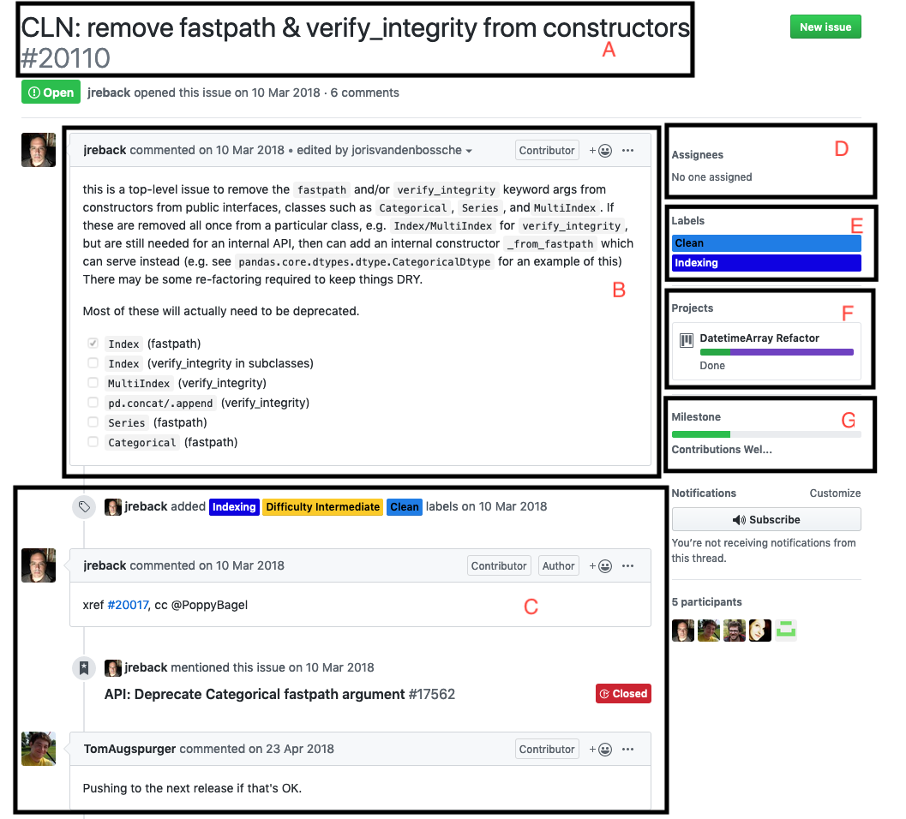

# GitHub Repo "projects"

For now, we keep track of our projects in a central [GitHub repository](https://github.com/CorrelAid/projects). This repository is private because of the potentially sensitive information stored there. If you need access because you are coordinating a project, then contact Frie \(@frie\) on Slack.

### GitHub issues 

Each project is stored as a GitHub issue. GitHub issues are usually used in software development projects to keep track of to-dos, bugs etc. 

GitHub issues have certain features. Let's look at an [example issue ](https://github.com/pandas-dev/pandas/issues/20110)and let's see how we'll make use of them when keeping track of CorrelAid projects compared to typical software development use cases.

| Letter | Name |  software development | CorrelAid project |
| :--- | :--- | :--- | :--- |
| A | issue title | a short title that summarizes the feature / bug / to-do.  | typically the name of the organization |
| B | issue description | a more detailed description of the feature / bug  | details on the organization, what kind of data they have \(if any\), etc. There's a template for this \(explained below\). The description can be updated throughout the course of the project \(e.g. we might later find out what data they have etc\).  |
| C | comments, updates | discussions related to the issue, e.g. clarifications \(what system has the issue submitter?\), technical discussions, code review discussions, etc. | updates over the course of the project, e.g. if there are delays at the organization's side or other information that is not important for the description.  |
| D | assignee\(s\) | who is responsible for fixing the bug / implementing the feature  | who is the project coordinator for the project? This can change over the course of a project, e.g. when the original project coordinator does not have time anymore.  |
| E | label\(s\) | used to group issues thematically.  | we use labels to keep meta information about the projects. More below.  |
| F | project boards | project boards are GitHub's implementation of [Kanban boards](https://en.wikipedia.org/wiki/Kanban_board) --&gt; usually there are at least three "columns" of a project board: "to-do", "in progress" and "done". Issues are then moved to the next stage once completed. E.g. when an work on an issue is started, it's moved from "to-do" to "in progress".  | We represent our project progress using a project board. There are several phases a project goes through, from initial aquisition over ideation to project work. All stages are outlined below.  |
| G | milestone | "You can use milestones to track progress on groups of issues or pull requests in a repository." | NA |

