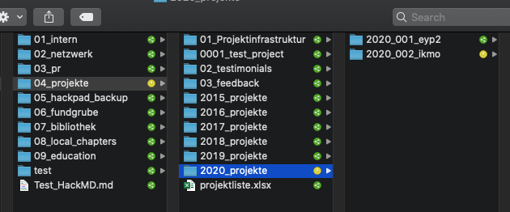
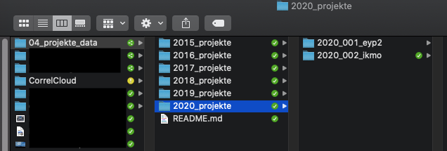

# Onboarding

#### Goals

* enable the team to communicate with each other
* make data available to the team
* set up project tools 

#### Checklist


* [ ] create private Slack channel and add team members
* [ ] create [Git](../../wiki/infrastructure/github-and-gitlab.md) repository and add members
* [ ] set up CorrelCloud 
* [ ] data transfer via CorrelCloud
* [ ] coordinate kickoff workshop


## Quick links


The most important links from this section in one handy little box:

* [CorrelCloud folder](https://correlcloud.org/index.php/s/N8rXFWpbNJDNiZS) with 
  * confirmation of participation template
  * data security declaration template
  * example project folder with an example veracrypt container
* [Data privacy & security page](../data-security-and-privacy.md)
* Walkthrough tutorial video for creating the veracrypt container


## Create Git repository 


Who: Project lead or project coordinator


Usually, our project teams use GitHub \(or GitLab\) for collaboration. To request a repository in the CorrelAid GitHub or GitLab team, please proceed as followed:

1. in your project team channel, collect the GitHub \(or GitLab\) of all team members.
2. request a GItHub/GitLab repository by following this [FAQ](../../wiki/infrastructure/github-and-gitlab.md#i-want-to-create-a-github-gitlab-repository-for-my-project-and-add-my-team-to-it-how-do-i-do-it).
3. A GitHub / GitLab admin will help you as soon as possible. 

## Create Slack channel

It is important that project teams use Slack to communicate. Usage of alternative communication channels within the project team \(email, messengers, ...\) should be discouraged.

If you have not created a private Slack channel as part of the ideation phase, you should do so now. Invite or [request to invite](../../wiki/communication/slack.md#i-want-to-get-access-to-slack-how-do-i-get-it) all project team members if they are not part of the CorrelAid Slack workspace yet and add them to the channel. 


**Why is it important that project teams communicate on Slack?**

1. Access to the community. Having the team communication on Slack gives team members instant and direct access to the community, e.g. the \#help channel. It is also easier to get in contact with their project coordinator\(s\) because they are part of the channel, get infrastructure support \(\#infrastructure\) and to feel part of the larger CorrelAid community.
2. Better project coordination. While the main work of the project coordinator is in the earlier phases of a project, they are also responsible for making sure that the project works as expected. If the project coordinator is part of the main communication channel, they can get a better feeling for how the project is going and offer their help directly. 
3. Archive. Communication is centralized and stored on Slack. This means it is easier to go back and find old conversations if necessary. 


## Data Transfer with CorrelCloud

While our project teams usually use GitHub or GitLab for their project work, we use our NextCloud instance CorrelCloud for the initial data transfer from the organization to CorrelAid and from CorrelAid to the project team members. 

### Set up CorrelCloud


Who: Project coordinator together with project coordination admins


#### Set up CorrelCloud team

Please ask one of the [CorrelCloud](../../wiki/infrastructure/correlcloud.md) administrators to invite your team members. For this, the admin will need their full names and email addresses. 

#### Create folder inside the CorrelCloud folder **`04_projekte`**

You should be able to create a folder for your project _within_ the CorrelCloud. 

In this folder, you can store documents that can be accessible for **all** CorrelCloud users such the encrypted VeraCrypt container and  certificates of participation.

#### Create restricted-access folder outside CorrelCloud folder in `04_projekte_data`

For each project **where the data cannot be shared via GitHub or GitLab**, another folder has to be created _outside of the CorrelCloud folder_ in the **`04_projekte_data`** folder structure to **share the raw data**. This can only be created by the project coordination admins who are Manuel \(@Manuel on Slack\), Frie \(@frie on Slack\) and Sebastian \(@sezulka on Slack\). The project coordination admin then shares the created project folder with the project team.

### Get data from NPO

#### File drop via CorrelCloud


Who: Project lead or project coordinator


If the data is in any way sensitive \(personal data or sensitive non-personal data\)  the CorrelCloud should be used. In order to do so, you can create a secure file drop in the "secure" folder under 04\_projekte\_data \(see above\) where the organization can upload their data. 

#### Other channels

Only if the data is not sensitive, other channels such as Google Drive or email can be used for the file transfer. 

## Inform team members about data privacy & security


Who: Project lead in coordination with the project coordinator


Make sure to inform your team members about the data privacy and security considerations for the project. If you are unsure about what applies to your project, ask the project coordinator - they should know this. Express yourself as clearly as possible in DO's and DON'Ts. For examples, please see [here](ideation-finding-a-team.md#data-privacy-and-data-access). 

If encryption is necessary for your project, share [this documentation page](../data-security-and-privacy.md#data-encryption) with them so that they can familiarize themselves with the options. A more detailed introduction to the tools should be part of the [kickoff](kickoff.md). 

### Data privacy policy statement

If the project has **any** data privacy requirements, the participants and the organization need to sign the **declaration on data security**. 

You can download German and English templates [here](https://correlcloud.org/index.php/s/N8rXFWpbNJDNiZS). They contain the requirements for the highest security setup \(including the requirement to create a separate user account\), so please make sure to adapt them to your specific project by removing passages not needed for your project. If you're unsure, ask your project coordinator or our data privacy expert Thomas \(@Thomas on Slack\). 

**This** 

## Set up and share the VeraCrypt Container


Who: Project lead


**If the data need to be encrypted**, the project lead should set up a VeraCrypt container for the team to facilitate the onboarding process.


Please choose a secure password for the container and **not** "NPO\_project\_2020". A good compromise between passwords that are hard to remember \(e.g. "oohbGHc3\*YBLFV96yFrfzUWeH"\) and insecure passwords \(see above\) are  **passphrases** consisting of random words such as "pacifism publisher gradually playmate". Learn more [here](https://www.useapassphrase.com/). 


1. create a container using VeraCrypt. Make sure that it is big enough to hold the complete project.
2. mount the container
3. clone the [GitHub / GitLab](../../wiki/infrastructure/github-and-gitlab.md) repository into the container 
4. do any project setup steps you'd like \(e.g. create RStudio project, add virtualenv configuration\)
5. add a data/raw folder
6. if the data must not be committed to Git, follow the workflow in this video
7. put in the data from the organization into data/raw. Make sure to follow [good file naming principles](https://speakerdeck.com/jennybc/how-to-name-files). Add a README.md to the data folder and document the folder + file structure \(e.g. with a screenshot from your data explorer\).

Upload the **VeraCrypt container file** to the CorrelCloud folder for your team. Share the password to the container via a **secure, encrypted** communication channel: [Signal ](https://signal.org)or [Keybase](https://keybase.io/) can be used, or you can share the password over a phone call. 


Please really use an **encrypted communication** channel for sharing the VeraCrypt container password. It is tempting to just send it over Slack but please don't do it. 


If you have team members who do not need to use VeraCrypt because they have an encrypted home drive, you can also upload the data directory to the CorrelCloud folder \(outside of the VeraCrypt container\). This way, the team members without the VeraCrypt requirement can clone the repository from GitHub / GitLab and manually copy + paste the data folder from the CorrelCloud folder. 

## 

