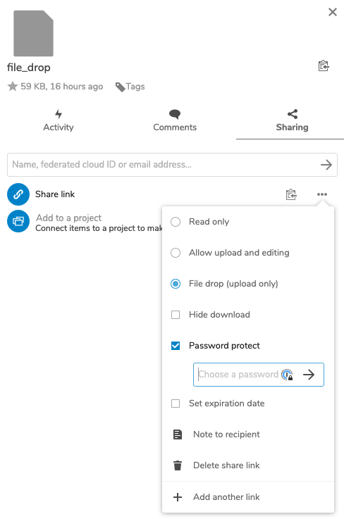

# Onboarding

#### Goals

* enable the team to communicate with each other
* make data available to the team
* set up project tools 

#### Checklist


* [ ] create private Slack channel and add team members
* [ ] create [Git](../../wiki/infrastructure/github-and-gitlab.md) repository and add members
* [ ] set up CorrelCloud \(if necessary\)
* [ ] data transfer via CorrelCloud \(or other means when data is not GDPR relevant\)
* [ ] coordinate kickoff workshop  
* [ ] separate 1-1 onboarding call with team lead


## Quick links


The most important links from this section in one handy little box:

* [CorrelCloud folder](https://correlcloud.org/index.php/s/7PSskX9yN7RKmoi) with 
  * confirmation of participation template
  * data security declaration template
  * example project folder with an example veracrypt container
* [Data privacy & security page](../data-security-and-privacy.md)


## Create Git repository


Who: Project lead or project coordinator


Usually, our project teams use GitHub \(or GitLab\) for collaboration. To request a repository in the CorrelAid GitHub or GitLab team, please proceed as followed:

1. in your project team channel, collect the GitHub \(or GitLab\) of all team members.
2. request a GitHub/GitLab repository by following this [FAQ](../../wiki/infrastructure/github-and-gitlab.md#i-want-to-create-a-github-gitlab-repository-for-my-project-and-add-my-team-to-it-how-do-i-do-it).
3. A GitHub / GitLab admin will help you as soon as possible. 

## Create Slack channel

It is important that project teams use Slack to communicate. Usage of alternative communication channels within the project team \(email, messengers, ...\) should be discouraged.

If you have not created a private Slack channel as part of the ideation phase, you should do so now. Invite or [request to invite](../../wiki/communication/slack.md#i-want-to-get-access-to-slack-how-do-i-get-it) all project team members if they are not part of the CorrelAid Slack workspace yet and add them to the channel.


**Why is it important that project teams communicate on Slack?**

1. Access to the community. Having the team communication on Slack gives team members instant and direct access to the community, e.g. the \#help channel. It is also easier to get in contact with their project coordinator\(s\) because they are part of the channel, get infrastructure support \(\#infrastructure\) and to feel part of the larger CorrelAid community.
2. Better project coordination. While the main work of the project coordinator is in the earlier phases of a project, they are also responsible for making sure that the project works as expected. If the project coordinator is part of the main communication channel, they can get a better feeling for how the project is going and offer their help directly. 
3. Archive. Communication is centralized and stored on Slack. This means it is easier to go back and find old conversations if necessary. 


### Welcome message 

It's always nice if people join a Slack channel and there is already a message waiting for them to get a conversation going. Hence, you should post a welcome message. This message should include the following:

* hello! short introduction who you are and what your role is
* ask them to introduce themselves
* reminder for the kickoff / link to program if it already exists

example:



Hello @channel,

we are very happy that you want to help **\[ORGANIZATION\]**. I am **\[XY\]** and I am the project coordinator for this project \[together with Frie \(@frie\)\]. That means if you have any questions or problems, please feel free to contact me. However, I will not be an active part of your team, but will stay in the background. 

please take a few minutes and: 

* briefly introduce yourself in the channel 
* post your GitHub account in the thread \(so we can add you to the GitHub repository\)
* join the channel \#projectcycle where we will share updates and info like zoom links for events that affect all projects in the project cycle 
* the next important event is the kickoff on **X** \(evening\) and **Y**\(morning + afternoon\). you can find the program for this very important event here: **LINK**. There you will also meet your contact person from **\[ORGANIZATION\]**. 

Until then feel free to network here in Slack and also check out the other channels if you are new here!



Hallo @channel,  
wir freuen uns sehr, dass ihr **\[ORGANISATION\]** helfen möchtet. Ich bin \[XY\] und koordiniere \[zusammen mit Frie\] dieses Projekt. D.h. wenn ihr Fragen oder Probleme habt, könnt ihr mich jederzeit gerne ansprechen. Ich werde allerdings nicht aktiver Teil eures Teams sein, sondern mich im Hintergrund halten.   
bitte nehmt euch ein paar Minuten und:

* stellt euch kurz im Channel vor
* postet euren GitHub Account in den Thread \(sodass wir euch zum GitHub Repository hinzufügen können\)
* tretet dem Channel [\#projectcycle](https://correlaid.slack.com/archives/C01T38KD0JU) bei, wo wir Updates und Infos wie z.B. Zoom Links für Events teilen werden, die alle Projekte des Projektzyklus betreffen

das nächste wichtige Event ist der Kickoff am **X** \(abends\) und **Y**\(vormittags + nachmittags\). das Programm für dieses sehr wichtige Event findet ihr hier: **LINK**. Dort werdet ihr auch eure Kontaktperson von **\[ORGANISATION\]** kennenlernen.Bis dahin netzwerkt sehr gerne hier im Slack und schaut euch auch in den anderen Channeln um, falls ihr neu hier seid!



## Data Transfer with CorrelCloud

While our project teams usually use GitHub or GitLab for their project work, we use our NextCloud instance CorrelCloud for the initial data transfer from the organization to CorrelAid and from CorrelAid to the project team members.

### Set up CorrelCloud


Who: Project coordinator together with project coordination admins


#### Set up CorrelCloud team

Please ask one of the [CorrelCloud](../../wiki/infrastructure/correlcloud.md) administrators to invite your team members. For this, the admin will need their full names and email addresses.

#### Create restricted-access folder in `04_projekte_data`

Ask one of the project coordination admins to createa folder with your project id \(e.g. 2021-02-COR\) in the **`04_projekte_data`** folder structure to **share the raw data**. This folder will only be accessible to you and your project team \(and the project coordination admins and the 3 CorrelCloud admins\). The project coordination admins who are Manuel \(@Manuel on Slack\), Frie \(@frie on Slack\) and Sebastian \(@sezulka on Slack\). The project coordination admin then shares the created project folder with you and the project team.

### Get data from NPO

#### File drop via CorrelCloud


Who: Project lead or project coordinator


If the data is in any way sensitive \(personal data or sensitive non-personal data\) the CorrelCloud should be used. In order to do so, you can create a secure file drop in the "secure" folder under 04\_projekte\_data \(see above\) where the organization can upload their data.

How to:

1. In your "secure" project folder \(aka the one which is part of `04_projekte_data`\), create a new folder `file_drop`
2. Open the folder in the CorrelCloud web interface
3. Click on the "share" icon in the "breadcrumbs" of the folder \(see screenshot below\)
4. Create a share link with the following properties: "file drop \(upload only\)" and "password protect". Choose a secure password \(e.g. by using a password generator or a [passphrase](https://useapassphrase.com)\). See screenshot below.
5. Copy the link by clicking on the copy symbol and send it to the NPO. In a second email, send the password. 

#### Other channels

Only if the data is not sensitive, other channels such as Google Drive or email can be used for the file transfer.

## Inform team members about data privacy & security


Who: Project lead in coordination with the project coordinator


Make sure to inform your team members about the data privacy and security considerations for the project. If you are unsure about what applies to your project, ask the project coordinator - they should know this. Express yourself as clearly as possible in DO's and DON'Ts. For examples, please see [here](ideation.md#data-privacy-and-data-access).

If encryption is necessary for your project, share [this documentation page](../data-security-and-privacy.md#data-encryption) with them so that they can familiarize themselves with the options. A more detailed introduction to the tools - particularly VeraCrypt -  should be part of the [kickoff](kickoff.md).

### Data privacy policy statement

If the project has **any** data privacy requirements, the participants need to sign the [**declaration on data security**](../data-security-and-privacy.md#declaration-on-data-security).

You can download German and English templates [here](https://correlcloud.org/index.php/s/7PSskX9yN7RKmoi?path=/template_data_privacy). They contain the requirements for the highest security setup \(including the requirement to create a separate user account\), so please make sure to adapt them to your specific project by removing passages not needed for your project. If you're unsure, ask your project coordinator or our data privacy expert Nina \(@Nina Hauser on Slack\). 

Upload the signed declarations to the CorrelCloud folder. 

