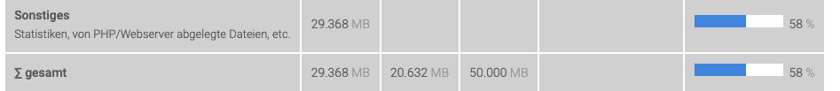

# CorrelCloud

The CorrelCloud is a NextCloud instance hosted on our Manitu. There, we have cloud storage (like Dropbox) for administrative files, pictures from meetups, etc.

* [correlcloud.org](https://correlcloud.org)


Need access to the CorrelCloud? Ask or Frie (@frie) on Slack.


### Troubleshooting

#### The "CorrelCloud Webhosting Package" is running out of space. Why?

Screenshot of the "Speicherplatz" area of the administration page for the CorrelCloud webhosting package which is accessible [here](https://mein.manitu.de/webhosting/) when logged in with the admin user.

This might be because certain users have not emptied their [trash bins](https://docs.nextcloud.com/server/13.0.0/user\_manual/files/deleted\_file\_management.html) and old, large files might be occupying space in the bin. To solve, tell the suspected users to empty their trash bin via the CorrelCloud Web Interface (in the side bar on the bottom left "Deleted Files"). Alternatively, you can delete single files from users' trash bins via the WebFTP interface (accessible from the administration page of the CorrelCloud webhosting package).

After emptying the trash bin of a CorrelCloud "power user":

## NextCloud / Storage Share

Starting April 2023, we have a so called Storage Share at Hetzner. This is the NextCloud offering of Hetzner.&#x20;

### Groups&#x20;

NextCloud has groups like Google Workspace. We aim to mirror the structure of the [Google Groups](google-workspace.md#google-groups-users) in Google Workspace on NextCloud. They are called the same, except for the `group` prefix: so, `group-ethics-committee` is `ethics-committee` on NextCloud.&#x20;

While we have separate groups for the heads of each group in Google Workspace, we don't have this on NextCloud as there are far fewer groups and people active on there. Instead, people who are `heads` on Google Workspace will be [group admins](https://docs.nextcloud.com/server/latest/admin\_manual/configuration\_user/user\_configuration.html#granting-administrator-privileges-to-a-user) of their NextCloud groups.&#x20;

> Group administrators have the rights to create, edit and delete users in their assigned groups. Group administrators cannot access system settings, or add or modify users in the groups that they are not **Group Administrators** for.&#x20;

### Manage people to the group you're admin of

1. Go to [https://cloud.correlaid.org/settings/users](https://cloud.correlaid.org/settings/users)&#x20;
2. Using the left sidebar, navigate to&#x20;

## Admin&#x20;

