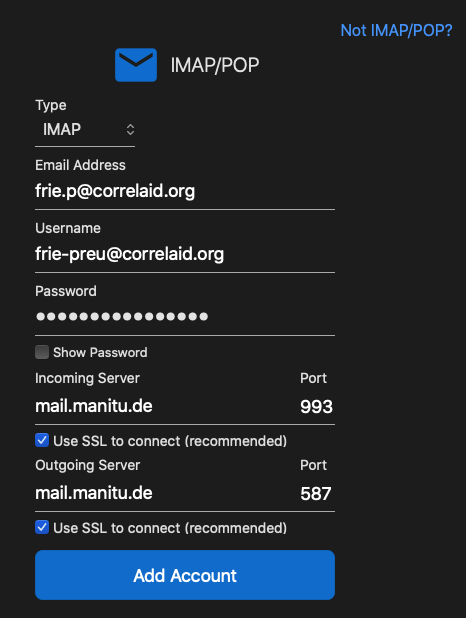
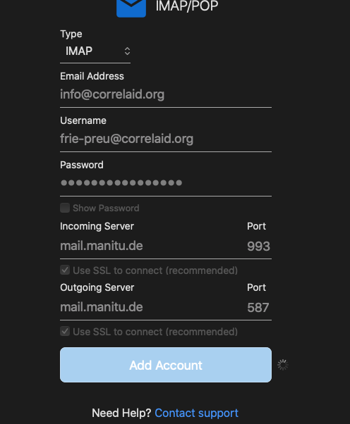

# Email & Webspace

Our Webspace is hosted by [Manitu](https://www.manitu.de). It consists of:

* Website Hosting
* Domains
* SQL databases
* Email hosting

## Login pages

### Email and user settings

* [https://webmail.manitu.de/](https://webmail.manitu.de): email client provided by Manitu
* [https://ngcobalt329.manitu.net:81/login/](https://ngcobalt329.manitu.net:81/login/) change password, configure auto-reply and mail filter. (if you're an admin you need to go manually to [https://ngcobalt329.manitu.net:81/user/](https://ngcobalt329.manitu.net:81/user/) after logging in)

### Forward DNS configuration

* [https://mein.manitu.de/login/](https://mein.manitu.de/login/): for access to forward-dns configurations (admin user only).

### Email, user, general domain administration

* [https://ngcobalt329.manitu.net:81/siteadmin/](https://ngcobalt329.manitu.net:81/siteadmin/) : for access to email and user management console (admin-only).


Want to help us with administering our website or our email hosting? Ask **Frie (@Frie)** on Slack for access.


## Inbox and email addresses

At Manitu, there is a distinction between username and your email address. This can be confusing because usually your username is also your email address (e.g. at gmail). In the following, we want to clear this up.

### User name and inbox

Your **username** has the following pattern: {firstname}-{lastname}, e.g. frie-preu. Depending on context, you might also need to add @correlaid.org, i.e. frie-preu@correlaid.org. Your username is associated with your** inbox. **Your inbox is the place where **all of your emails **are stored. Note: your username is **not** an email address (even though it looks like it): emails sent to frie-preu@correlaid.org will not be delivered.

**To deliver emails to your inbox, we associate it with one or more email addresses. In Manitu terms, the user is the "target" (de: Ziel) of an email address. **

### Email address

There are several types of email addresses at CorrelAid.&#x20;

* personal email addresses: {firstname}.{first\_letter\_of\_last\_name}@correlaid.org&#x20;
* CorrelAidX chapter addresses: {city}@correlaid.org, e.g. berlin@correlaid.org or rhein-main@correlaid.org&#x20;
* other email addresses: {topic}@correlaid.org, e.g. education@correlaid.org.&#x20;

**Each user / inbox can be the "target" of one or more email addresses**. For example, the user / inbox frie-preu will get all emails that are sent to: frie.p@correlaid.org,  info@correlaid.org and education@correlaid.org. Other people are only the target of one address, e.g. our data security person is only the "target" of datenschutz@correlaid.org. He does not have a personal email address.&#x20;

On the other hand, **some email addresses have multiple "targets"**. Those are known as "distribution emails" (de: Verteiler). One example is info@correlaid.org: Both Frie and Johannes receive those emails.

**Special case for users with access to CorrelAidX Chapter addresses:** If you logged in to Manitu for the first time with your {firstname}-{lastname} **username**, Manitu will assume that you want to send emails from this domain. This won't work, because there is no email associated with your username. The email will send, but people won't be able to reply to you.&#x20;

.png>)

Instead, you need to click on the pencil and create a new identity associated with the local chapter address from which your emails will be sent:&#x20;

.png>)

If you go back to emails, you can now send emails from your chapter address.\

.png>)

## Manitu Webmail client

Manitu provides a webmail client under [https://webmail.manitu.de](https://webmail.manitu.de) .&#x20;

To login, please use the following information:

* Benutzername (username): your username ({firstname}-{lastname}})
* Passwort: your passwort
* Domain: mail.correlaid.org

## Configuring Email Clients

You can find the basic settings for configuring your email client (e.g. Thunderbird, Outlook, Apple Mail) in the [Manitu Wiki](https://wiki.manitu.de/index.php/Webhosting:SSL-Verschl%C3%BCsselung\_f%C3%BCr\_E-Mail-Versand\_und\_-Empfang\_aktivieren).


The following **only applies if you have a Manitu account**. Sometimes, we also have configured forwarding to external email addresses (such as your personal gmail address). In this case, you log into your own email address (e.g. gmail) to read your CorrelAid emails. If you're unsure, ask Frie.&#x20;


### Personal CorrelAid email address

For your personal CorrelAid address (e.g. frie.p@correlaid.org), you use:

* email address / Email-Adresse: your email address, e.g. frie.p@correlaid.org
* username / Benutzername: your username, e.g. frie-preu@correlaid.org
* password: your password for Manitu.&#x20;
* for the server information, please see the [Manitu wiki](https://wiki.manitu.de/index.php/Webhosting:SSL-Verschl%C3%BCsselung\_f%C3%BCr\_E-Mail-Versand\_und\_-Empfang\_aktivieren)

What this will enable you to do:

* **read** _all _emails that are sent to email addresses that your user name is a "target" for, e.g. Frie can read all emails sent to frie.p@correlaid.org, info@correlaid.org and education@correlaid.org
* **send** from your personal address, e.g. Frie can reply to emails as frie.p@correlaid.org.&#x20;

### CorrelAid Verteiler / distribution email

In case you are the "target" of a CorrelAid distribution email like berlin@correlaid.org, education@correlaid.org etc. you can add it to your favorite email client by using:

* email address / Email-Adresse: the email address you want to add, e.g. berlin@correlaid.org
* username / Benutzername: your username, e.g. frie-preu@correlaid.org
* password: your personal password for Manitu. There is no separate password for distribution emails.
* for the server information, please see the [Manitu wiki](https://wiki.manitu.de/index.php/Webhosting:SSL-Verschl%C3%BCsselung\_f%C3%BCr\_E-Mail-Versand\_und\_-Empfang\_aktivieren)

What this will enable you to do:

* **read**_ _emails that are sent to _all_ email addresses that your user name is a "target" for, e.g. for Frie, it will contain all emails sent to frie.p@correlaid.org, info@correlaid.org and education@correlaid.org. This is a bit counterintuitive but you are logging into your **personal inbox **(firstname-lastname)** **which contains all of your emails, regardless of&#x20;
* **send** using the distribution email, e.g. Frie can reply to emails using info@correlaid.org.&#x20;


You _don't have to_ add (all) distribution emails you are a "target" of separately to your email client. You can already _read_ all of them by just adding your personal email. However, if you only add your personal email address, you won't be able to reply using the distribution email, i.e. all your replies will come from your personal email address.


## FAQ

### I need my own @correlaid.org email address. How do I get it?

Please ask @Jan (Jan Dix) on [Slack](../faq.md#everything-seems-to-be-on-slack-how-do-i-get-on-there).&#x20;

### How can I add my email to Thunderbird, Outlook etc?&#x20;

Please see the guide [above](email.md#configuring-email-clients).&#x20;

### How can I change my password?

Login at [https://ngcobalt329.manitu.net:81/user/](https://ngcobalt329.manitu.net:81/user/).&#x20;

