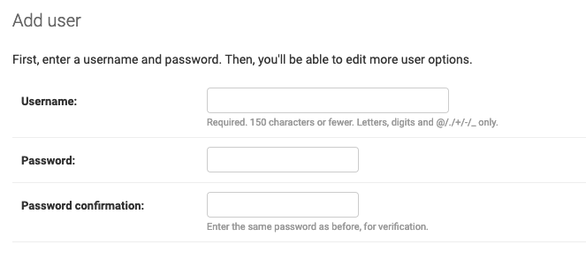
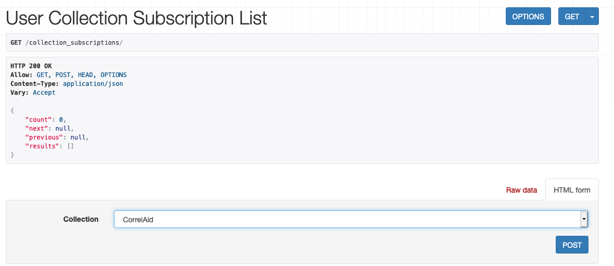
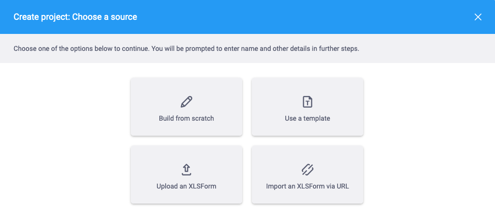

# Kobotoolbox for Forms

* We host our own instance of [kobotoolbox](https://www.kobotoolbox.org) at [kobo.correlaid.org](https://kobo.correlaid.org).&#x20;
* To request an account, join the slack channel #infrastructure-kobo-toolbox and ask there
* The above -mentioned slack channel also serves as a communication channel for announcing maintenance periods and for asking general questions about the service

## User management

Users are managed by \_super admins \_in the administrative backend which is available at [kobo.correlaid.org/admin](https://kobo.correlaid.org/admin).

Here, admins can create and delete users and manage other settings of the Kobo instance (but most of which should be just left alone).

**Important**: this is not where you give access to individual surveys etc. This is done in the User Interface at [kobo.correlaid.org](https://kobo.correlaid.org).

### Adding a User

Go to [https://kobo.correlaid.org/admin/](https://kobo.correlaid.org/admin/).

1. **Add user**

Click on "Add" next to "Users" and you can set a user name and password for the new user.

Important: **User names should follow the {firstname}\_{first letter of surname} format**. Using dots (".") in user names definetly causes some weird problems, so this should be avoided at all cost. The password should obviously follow good password principles.

Once you click on "Save", you'll be redirected to the settings page for this user. Leave the default settings and click "Save" again.

2. **Associate Email address to user**

Since an update to a newer version, we have to associate an email address to the user, otherwise the login will not work. To do that:

1. go to **Email addresses**: [https://kobo.correlaid.org/admin/account/emailaddress/](https://kobo.correlaid.org/admin/account/emailaddress/)&#x20;
2. top right, click add email address.&#x20;
3. next to "User" there is a :mag:. Click on it.
4. A pop up will appear where you can select the target user by clicking on their name
5. the pop up should close. The displayed number is the numeric ID for the user you selected.
6. enter the email address and check both tick boxes (Verified and Primary)

<figure><figcaption></figcaption></figure>

3. **Share the password with the user**&#x20;

Adding the email **will not send out** an automated invitation. To share the password with the new user, you can use a [Yopass link ](https://yopass.se/)(make sure to change the expiration date to one week).&#x20;

## CorrelAid collection

### Subscribe to the collection

We have created the **public CorrelAid collection** which you can see when going to [https://kobo.correlaid.org/#/library](https://kobo.correlaid.org/#/library) and selecting "Public collections" in the bar on the left. The collection provides template surveys and question blocks for questions that we ask. In order to use the questions and template surveys in this collection, you need to "subscribe" to it. Unfortunately, there is a [bug](https://github.com/kobotoolbox/kpi/issues/2813) in the frontend of Kobo - the "Subscribe" button does not work. However, there is a workaround:

1. Open [https://kobo.correlaid.org/collection\_subscriptions/](https://kobo.correlaid.org/collection\_subscriptions/).
2. In the dropdown at the bottom, select "CorrelAid" if it is not already selected.
3. Click "POST"
4. If you go back to [https://kobo.correlaid.org/#/library](https://kobo.correlaid.org/#/library), the CorrelAid collection should now be in your personal library and you can use the questions and/or the template surveys.

### Use the template surveys

When creating a new project, you can use the template surveys by selecting "Use a template" in the "Create project" dialogue. This will copy the template survey into your project.

## API

Kobo has an API you can use.

### Documentation

You can find the documentation here:

* version 2: [https://kobo.correlaid.org/api/v2/](https://kobo.correlaid.org/api/v2/) -> current version of the API - covers getting data, uploading forms etc.
* version 1: [https://kc.correlaid.org/api/v1/ ](https://kc.kobotoolbox.org/api/v1/)(should only rarely be used) -> upload data to existing forms

### Getting your token

You can find your token in your user settings: [https://kobo.correlaid.org/#/account-settings](https://kobo.correlaid.org/#/account-settings)

####
