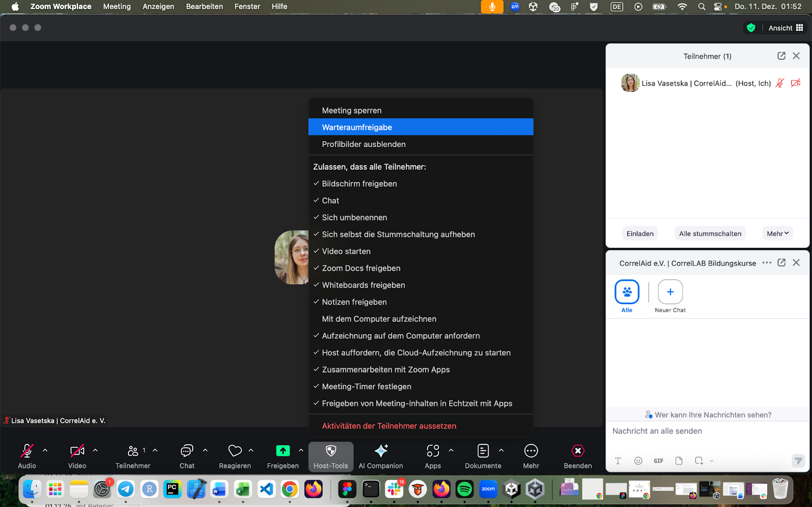

# Moodle

There are different roles in Moodle. If you are not part of the education team, you should have a role as a "participant" or "guest" which allows to view pages in Moodle. The education team should have the role of "manager" or "trainer" and can edit pages in Moodle.

## Using Moodle

Our courses have a hierarchical structure:

### 1. Sections&#x20;

&#x20;

&#x20;

Most courses have two sections: “General Information” and “Module Overview,” which are visible to participants.

### 2. Sub sections

Withing the "Module Overview", one sub section per module can be found. Each Module has

* A banner as a decorative element
* The lesson containing the slides with course content, quizzes and homework. Clicking on this will lead you to all relevant contents of the module.
* Files containing all slides with course content for download purposes, homework or other material.
* Feedback allows to give feedback - this is an option for course participants, if you have feedback as a tutor, you should directly text the education team.

## Editing Moodle

In order to edit pages in Moodle, the “Edit” button at the top right must be activated.

Add sections by scrolling all the way down and pressing "+". Sections, like almost all other elements in Moodle, can be set to “hidden” (three vertical dots → "Hide").

.png>)

\
 

