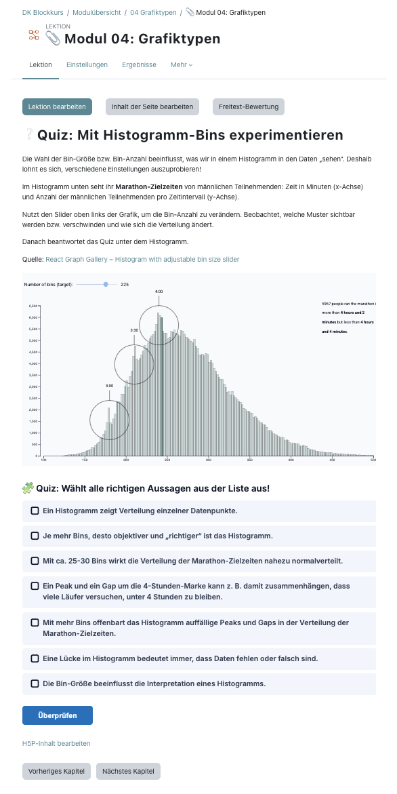
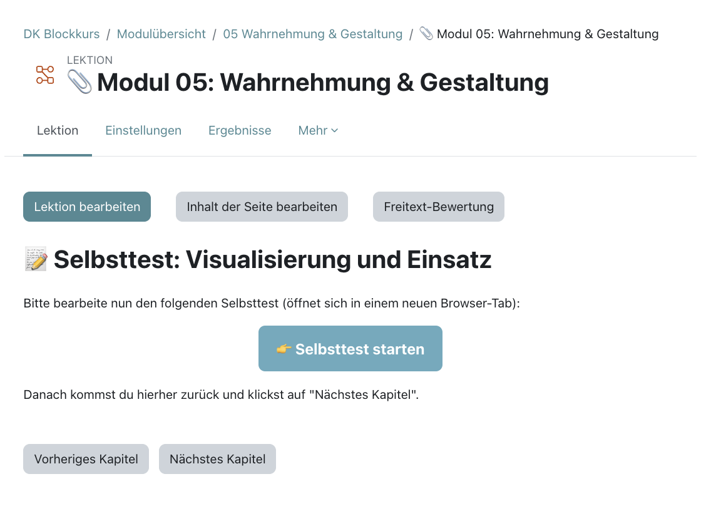

# Moodle

There are different roles in Moodle. If you are not part of the education team, you should have a role as a "participant" or "guest" which allows to view pages in Moodle. The education team should have the role of "manager" or "trainer" and can edit pages in Moodle.

## Using Moodle

Our courses have a hierarchical structure:

### 1. Sections&#x20;

&#x20;Most courses have two sections: “General Information” and “Module Overview,” which are visible to participants.

### 2. Subsections

Withing the "Module Overview", one sub section per module can be found. Each Module has

* A banner as a decorative element
* The lesson containing the slides with course content, quizzes and homework. Clicking on this will lead you to all relevant contents of the module.
* Files containing all slides with course content for download purposes, homework or other material.
* Feedback allows to give feedback - this is an option for course participants, if you have feedback as a tutor, you should directly text the education team.

## Editing Moodle

In order to edit pages in Moodle, the “Edit” button at the top right must be activated.

&#x20;.png>)

### 1. Sections

Add sections by scrolling all the way down and pressing "+". Sections, like almost all other elements in Moodle, can be set to “hidden” (three vertical dots → "Hide").

 (1) (1).png>)

### 2. Subsections

Add subsections by clicking on the "+" inside the section. Once you have created a subsection, you can click on the three dots at the top → “Edit settings” and add an image (e.g., a module banner) or a text description there.

.png>)

Under “+ Create activity or resource,” you can then create individual resources—Moodle has a wide range to choose from:\
 (1).png>)\
For our purposes, the following three have been particularly relevant so far:

* Lesson: This contains the Canva slides with course content, quizzes and homework.
* File: This is how all PDF and PPTX files are integrated, as well as CSV/Excel exercise data sets. When you create a file, check the boxes for “Show description” and, in the Display section, for ‘Size’ and “Type”.
* Feedback

### 3. Lessons

As soon as you create a lesson → “Save and display,” this window appears:

.png>)

So far, modules are built with content pages. Add a chapter with “Insert content page” or change it with “Edit content page”. Then, the content page can be filled.

.png>)

#### a) Navigation

The options “Content 1” and “Content 2” under “Page content” refer to navigation between the various content pages of the module – i.e., how participants can switch from one content page to another. So far, we have structured the content linearly – which is why only “Previous page” and “Next page” are specified for the ‘jumps’ and named “Previous chapter” and “Next chapter” accordingly. These “jumps” then appear as buttons below the content on the individual content pages of the lesson for the participants.

.png>).png>)

#### b) Page content

The content of each content page is a chapter of the module or a quiz/homework assignment/video in the module. Accordingly, a module/lesson consists of many content pages.

**Slides**

If you want to embed slides (chapter/block of a module or homework assignment) and these slides are stored in Canva, you need HTML code with a link to a Canva slide set. This HTML code with the tag + link can be generated and copied for a Canva slide set (“Share” → ‘Embed’ → “HTML code for embedding”).

.png>)

To insert the HTML code on a content page, click on “View” → “Source code” in the page content and then copy it into the pop-up window (you may be familiar with this from LimeSurvey, where you can adjust the formatting of content/questions directly via HTML).

.png>)

**Quizzes**

The quizzes are created in Moodle as H5P content (= HTML5 Package; framework for interactive content). To add a quiz, go to the “Edit content page” and select the “Insert H5P content” option → “Browse repositories.” This will take you to the file selection in the content repository, where you will find all the quizzes that have already been created (in the bar at the top, you can navigate between the quizzes of different courses in the content repository). Select one of these and insert it.

.png>).png>)

To create a new quiz yourself, you can either click on the gear icon next to the file selection in the content storage or click on “More” → “Content storage” in the top bar on the home page or course page. There are many quiz types to choose from. “Questionset” allows multiple quiz types and questions in one quiz and “Drag the Words” can be used to leave out words. Name quizzes clearly and add backgrounds.

Once you have created and saved a content page, you can add further content pages under “Actions.” There you will also find an overview of the jumps from each content page, and you can edit each content page individually (pencil icon) and change the order (arrow icon).

**Embedding external content with HTML**

Besides Canva slides or H5P content, you can embed other web content on a content page and combine it with text and H5P using the HTML source code view of the editor.

_**Example 1**_: A part of an external interaktive webpage is embedded with an `<iframe>` and combined with plain text and an H5P quiz.

<figure><figcaption></figcaption></figure>

_How the cropping works:_ The iframe loads the whole webpage, and a surrounding `<div>` shows only a small window of it:

````
```html
<div style="width: 100%; height: 430px; overflow: hidden;">
  <iframe
    title="Histogram with adjustable bin size"
    style="width: 2200px; height: 5000px; border: 0;
           transform-origin: 0 0;
           transform: translate(-395px, -1310px) scale(0.723);"
    src="https://www.react-graph-gallery.com/example/histogram-slider-bin-size"
    scrolling="no" loading="lazy">
  </iframe>
</div>
```
````

* **`height`** of the di&#x76;**:** height of the visible window
* **`overflow: hidden`:** hides everything outside the window
* **`scale()`:** shrinks the page (0.723 = 72.3 %)
* **`translate()`:** moves the page so the part you want lies inside the window. Negative values move it left and up.

The main challenge is finding the right values.&#x20;

_**Example 2: Custom buttons**_

Using the same approach, you can design custom buttons in the HTML source code view to make navigation clearer and more user-friendly, as shown in the screenshot.

<figure><figcaption></figcaption></figure>

Code:

```
<p>Bitte bearbeite nun den folgenden Selbsttest (öffnet sich in einem neuen Browser-Tab):</p>

<p style="text-align: center;">
  <a style="background: #68aabe; color: white; font-weight: bold;
            padding: 14px 22px; text-decoration: none; border-radius: 8px;
            display: inline-block; font-size: 18px;"
     href="https://correlaid.lernerfolg.info/mod/h5pactivity/view.php?id=484"
     target="_blank" rel="noopener">👉 Selbsttest starten</a>
</p>

<p style="margin-top: 6px;">Danach kommst du hierher zurück und klickst auf „Nächstes Kapitel“.</p>
```

* **`background` / `color`:** button and text color
* **`padding`, `border-radius`, `font-size`:** size and shape of the button
* **`href`:** target of the button. Adjust the link when you reuse the code in another course, otherwise it points to the old activity.
* **`target="_blank"`:** opens the link in a new tab

### 4. Test

To test if everything is displayed the right way, you can switch your role to “participant.”

.png>)

### 5.  Participant management

#### a) Create participants

Accounts for new participants are created manually. In the bar at the top choose "Website administration" → "Users" → "Create user".

Then, on the “General” page, add the first name, last name, and email address from the Excel list with participant data (usually located in Next Cloud) → Check the box as shown in the screenshot. Then scroll all the way down → “Create user.” Repeat the process until the participant list is complete.

.png>)

#### b) Enroll participants

After creation, participants need to be enrolled into a specific course to see its contents. On the page for the respective course, click on “Participants” in the top bar → green button at the top “Enroll users” → a pop-up window opens → “Search” → select participants from the list (you can type in the first letters of their names so you don't have to scroll through all the names) → Select participants one after the other → “Register users.”

