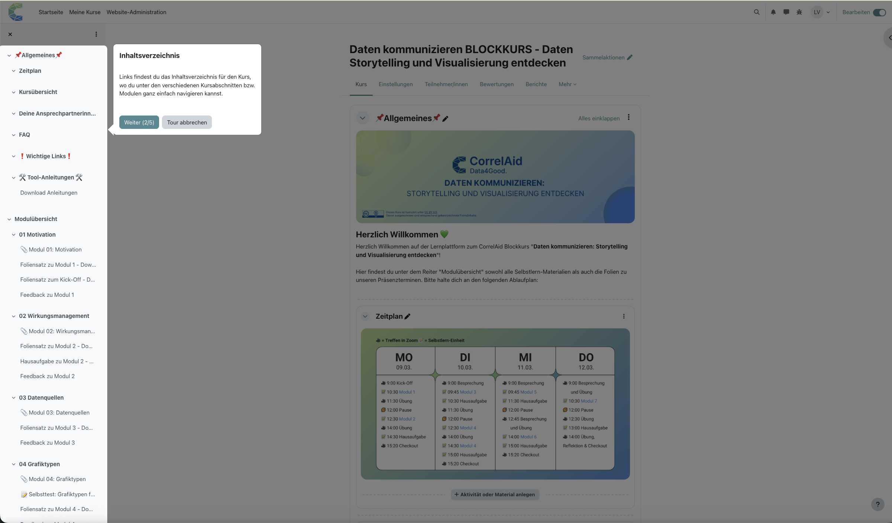
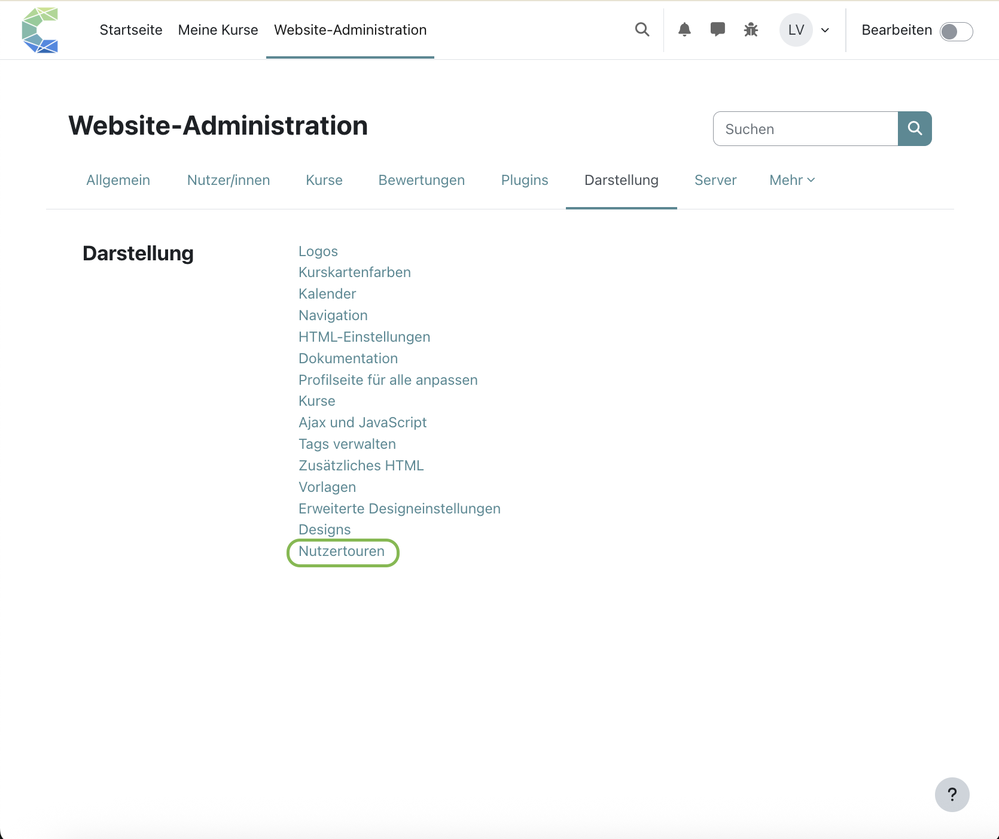
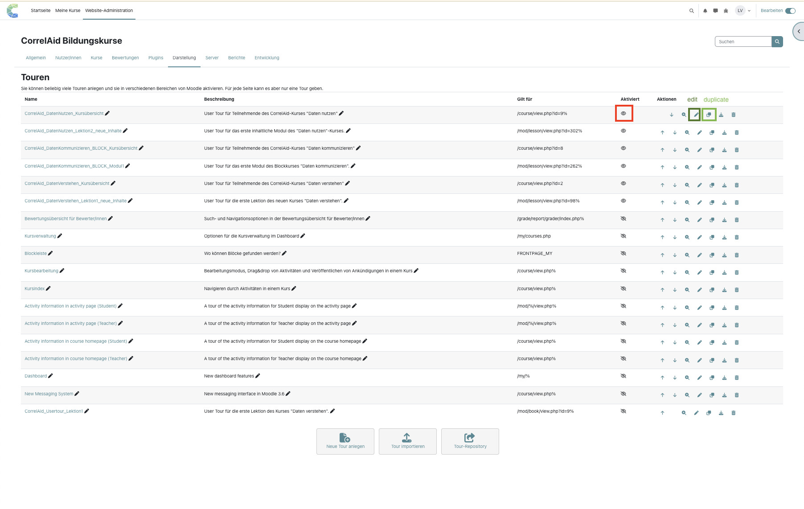
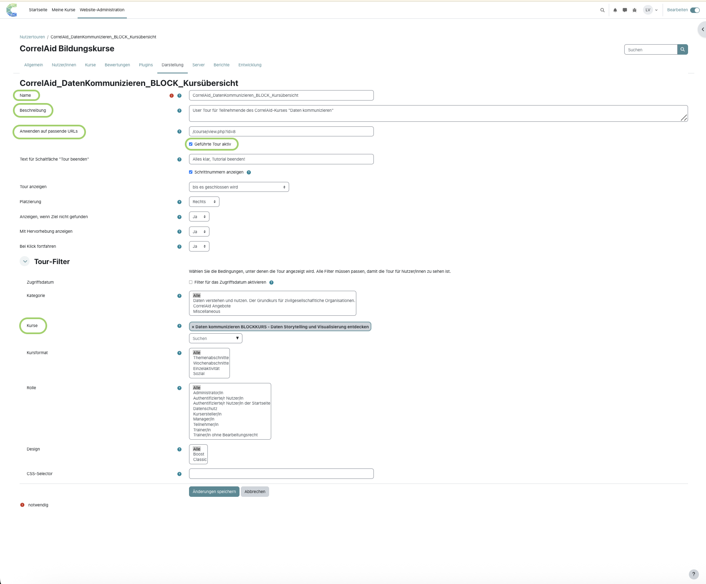
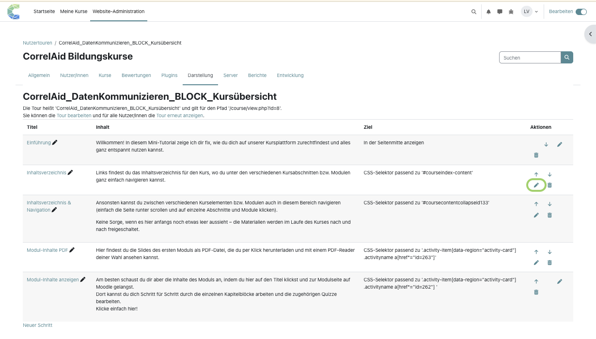
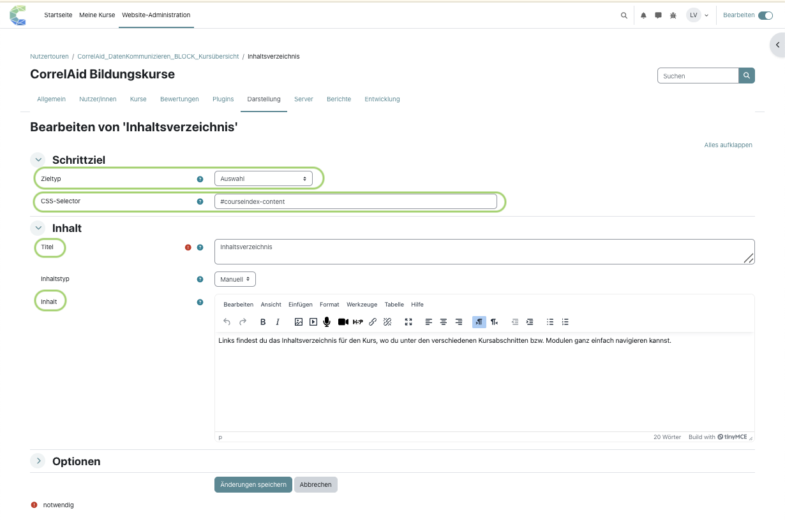

# Moodle: User tours

A user tour is a short step-by-step guide that appears directly on a Moodle page. Each step highlights one element of the interface and explains it in a pop-up. User tours are useful for onboarding new course participants. The tour usually starts automatically on the first visit. Here is an example:

<figure><figcaption></figcaption></figure>


**Requirement:** Only site administrators can create user tours (= you need admin rights).


## Finding the tours

Path: _Site administration > Appearance > User tours_

<figure><figcaption></figcaption></figure>

The "Tours" page lists all existing user tours and their status (enabled or not). The tours at the bottom of the list were created automatically by Moodle and are disabled (crossed-out eye icon).

<figure><figcaption></figcaption></figure>

Each tour is linked to one URL pattern. If you want tours on two different pages of a course (e.g. the course overview and the first lecture), you need two separate tours.

Since CorrelAid courses share a similar structure, you can reuse existing tours: duplicate them (two-squares icon), then edit them (pen icon).

## Adapting a duplicated tour

When you duplicate a tour, you need to adjust several things:

#### 1. Tour settings (klick the pen icon)

* **Name** and **Description**
* **Apply to URL match**, e.g. `/course/view.php?id=123`. `%` works as a wildcard.
* **Filters:** Course or Category, to show the tour only in specific courses
* **Tour is enabled:** check that it is switched on

<figure><figcaption></figcaption></figure>

This page lists all steps of the tour. You can edit, delete or add steps.

#### 2. Tour steps (click the tour name in the list)

This page lists all steps of the tour. You can edit, delete or add steps.

<figure><figcaption></figcaption></figure>

The screenshot below shows the edit form of the step "Inhaltsverzeichnis" (table of contents) in the tour "CorrelAid\_DatenKommunizieren\_BLOCK\_Kursübersicht".

<figure><figcaption></figcaption></figure>

* **Target type (Zieltyp):** Choose between "Display in middle of page", "Block" or "Selector" ("Auswahl" in the German interface, as shown in the screenshot). With "Selector", the step points to a page element defined by a CSS selector.
* **CSS selector:** Required if the target type is "Selector". It must identify a _unique_ element on the page. To find it, right-click the element in the browser, choose "Inspect", select the element the pop-up should point to and look for an ID or class. This can be tricky. An AI chatbot can help, but test the result in the tour.
* **Title:** heading of the pop-up
* **Content:** explanation text

## Testing

You can test the tour as often as you like: click the question mark on the course page and select "Reset user tour on this page" ("Tour erneut anzeigen" in the German interface).
