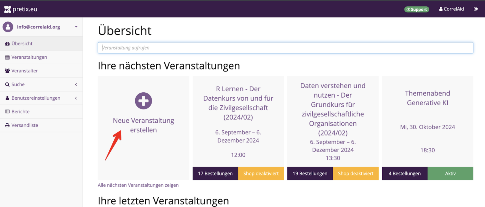

# OpenProject

The official documentation can be found here: [https://www.openproject.org/docs/](https://www.openproject.org/docs/).

### Customizing "My Page"

You can add individual shortcuts to your home page: favorite projects or overviews of to-do lists that have been assigned to you or from specific projects, etc.:

<figure><figcaption></figcaption></figure>

### Projects



When you go to projects, you can find a list of already existing projects in our CorrelAid team:




<figure><figcaption></figcaption></figure>




You can also create a new project:




<figure><figcaption></figcaption></figure>




<figure><figcaption></figcaption></figure>



Go to "Project Settings" to adjust some important settings first. For instance, within "Modules" you can define the tabs and views within your project, within "Work packages" you can define different types and categories for your tasks within the project:



<figure><figcaption></figcaption></figure>



<figure><figcaption></figcaption></figure>



Also check the tab "Members" to add members or groups to your projct. Please note that administrators have access to all projects as a default setting.

### Boards

You can create Kanban boards in the tab "Boards" and customize lists on your board:

<figure><figcaption></figcaption></figure>

Here you can add tasks, summary tasks and milestones. Please insert the following information:



* Name of the task
* Assignee and Accountable
* Priority
* Date (start and end)
* Category




<figure><figcaption></figcaption></figure>




:warning: If you add tasks in the Gantt chart overview, then they are not automatically added to your Kanban board, you can add them via "add existing" there. Thus: Create your cards in Board view!

### Gantt Charts

When you go to "Gantt charts", you're offered two default views: "All open" and "Milestones". You have different options to customize:

1) "Include Projects": Filter for specific projects in your overview.

<figure><figcaption></figcaption></figure>

2) "Filter": Add different filters, e.g. for assignees, status, or type.

<figure><figcaption></figcaption></figure>

3) "Configure View": Define columns, sorting, display setting, and zoom level.

<figure><figcaption></figcaption></figure>

4) "Save as": Save your configurated view for the next time!

<figure><figcaption></figcaption></figure>

### Types of Tasks

There are Tasks, Summary Tasks, and Milestones (besides many others...):

* Tasks: define small subtasks
* Summary Tasks: combine different tasks in one tasks (its time span is defined by the subtasks)
* Milestones: milestones, workshop dates, events, etc.

You can define hierarchies between those types:

<figure><figcaption></figcaption></figure>


{% column width="75%" %}
Hierarchies can be defined with a right click on a task or at the top of a task in detail view:


{% column width="25%" %}

<figure><figcaption></figcaption></figure>




#### Communicating on OpenProject

In an opened task, you can go to "Activity" to chat with others or tag individuals or groups with a @ to notify them:

<figure><figcaption></figcaption></figure>

